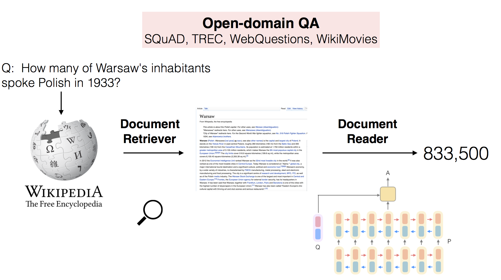
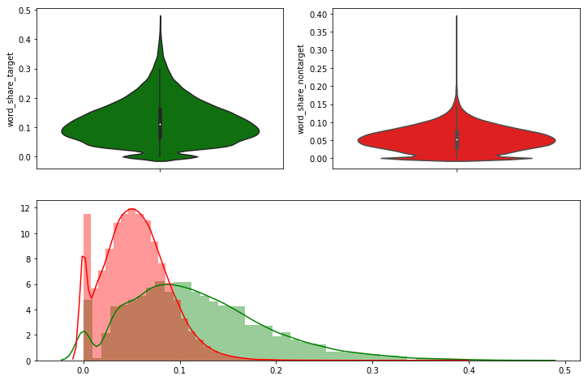
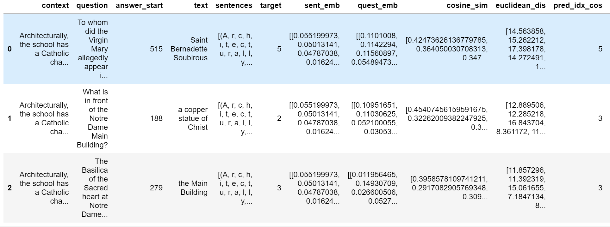
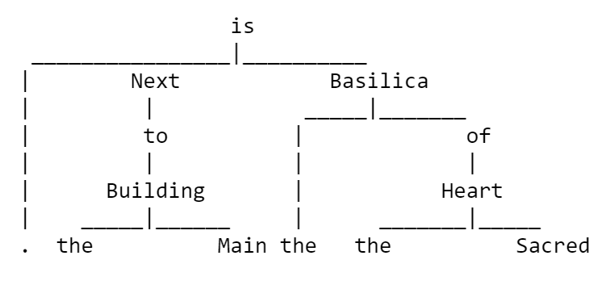
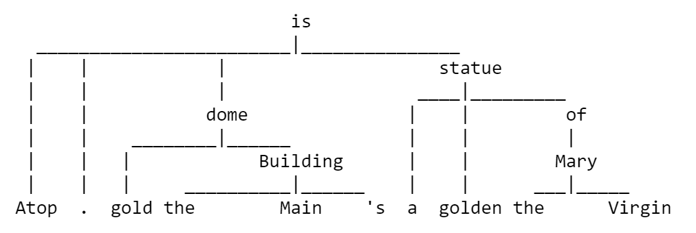
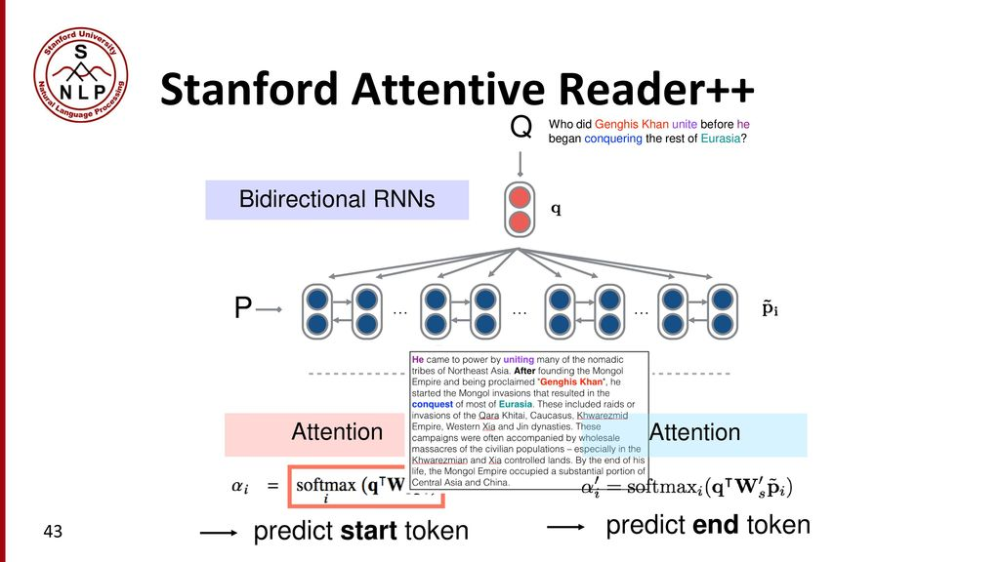

# Question answering with Wikipedia - NLP project 2019
We propose and explore a QA system based on data form Wikipedia and the Stanford Question Answering Dataset. We show different approaches to document retrival as well as reading. Including tf-idf and term frequency for retrival. Language models such as word2vec/glove, infersent(sentence2vec by fb research), ... Furthermore to we apply different supervised as well as unsupervised retrival approaches for the question answering aspect.

# 1)Summary:
For this project we outline a NLP framework that is able to find answers to simple questions within a set of articles. We created an algorithm that retrieves relevant articles and paragraphs within the article, based on multiple features including the similarity of keywords. Furthermore we propose a system to retrieve more natural exact answers, which are only spans of a sentence, exploiting techniques of part of speech tagging and leveraging recurrent neural networks. With this we hope to support students and enthusiasts by providing them a way to deepen their knowledge and find answers to domain specific questions easier and quicker.

The focus of the project is on comprehensions of the massive English Wikipedia and SQuAD corpus for training and testings. We tackle the problem of a question answering system by limiting our self to a subset of Wikipedia, due to its massive size.
We outline results using bag of word models, word2vec, sentence2vec representations in combination with different classification methods for text retrieval and comprehension. All implementations will are done in python leveraging multiple standard libraries such as numpy, pandas, nltk and gensim. The machine/deep learning components are be based on the pytorch framework which allows efficient use of resources as well as quick prototyping. Results are presented in form of a Jupyter notebook.
# 2)Results:

All approaches work reasonable well and within margin to the expected current state of the art. For retrieving the correct document and finding the appropriate sentence containing the answer to a given question, simpler and non-contextualized approaches work very well and in some cases even better than contextualized approaches. For obtaining and generating an exact answer these mechanical approaches often fail as it is a very hard task requiring semantic - or at least low level syntactical - understanding of the question, and the related answer to be able to extract the entities and related tokens the query asks for. Even harder is that in some cases multiple entities might appear in the same sentence cross-referencing each other, or an entity introduced earlier might be referenced later on in the text so that true semantic understanding and reasoning is necessary.

Classical techniques based on direct similarity and word share work very well for IR within the QA context on rich information sites such as Wikipedia. This can potentially be explained by the clear distinction in common words between a sentence that answers a given question and one that doesn't.

Using the common words similarity measure we were able to correctly identify the sentence (out of the entire article) containing the right answer to a given question in 63,28\% of the test cases in the SQuAD dataset. Using Jaccard similarity we achieved a non-significant improvement to 63,43\%. Employing sentence embeddings we were only able to do so in 44,72\% of the cases measuring similarity with euclidean distance and selecting the pair with the smallest distance. However using cosine distance we were able to achieve 63,37\% accuracy on the test set. The difference between eucledian and cosine distance is striking. It can most likely be explained by the fact that direction is most important in case of vectored word representations. In literature this is often accounted to the training process of word embeddings, causing words that occur often to have a bigger magnitude (up to a certain degree!). However for similarity measures, occurrence count is not necessarily a feature we want to rely on as it is heavily biased by the different article lengths. Cosine distance is "more immune" against this term frequency distortion. See \citet*{chen2017evaluating} for a short discussion on the pros and cons of cosine distance as similarity measure for word embeddings.

Taking a supervised approach, using the cosine similarity \(cs_i\) of each sentence \(s_i\) within a document as input feature for a random forest classifier and training it with 66\% of our data and evaluating on 33\% gave an match rate of 65,01\%.Employing a multilayer perceptron network the accuracy ranged from 40\%( 15 hidden units, 2 layer) to 64,03\%(150 hidden units, 2 layer). Adding more layers did not improve performance, also having more than 80 hidden units per layer does not significantly improve performance anymore. Using eucledian distance, cosine similarity and wordshare for each sentence as input feature we obtained an accuracy of 65,15\% for the random forest and ~47\% for the multilayer perceptron for various hidden unit sizes between 30 and 300. The idea of the supervised approach is that by using more features we can potentially obtain a more complete picture of the relation between text and question. Furthermore can we can learn from the similarity of following sentences to also find the correct answer in cases where a entity related to the answer is already introduced earlier in the text. The small maximal improvement of 1,7\% over the unsupervised approach however hints that either the classifier has not enough information to learn such more complex relations or the dataset simply does not contain many such cases.

As question answering can be seen as a very formal task when compared to for example having a conversation on tumblr or twitter it is not that surprising that approaches leveraging the syntax structure of the sentences such as POS taggers are performing reasonable well in identifying the exact answer to a given question.

Finding the exact correct text answer was done with an accuracy of 11,7\% using the domain knowledge rule based classification and with 17,5\% leveraging the POS tagging and entity type prediction. The recall was of the same value as whenever an answer was wrong no common words were exhibited and whenever the answer was correct, the predicted answer and the expected answer were identical. This can be explained by the fact that most expected answer as well as the retrieved answers given our system are of very simple structure with mostly only one entity as answer, which then in turn is either identical or mutually different. The DrQA based system emplyoing a RNN for the task achieved achieved 56\% accuracy.
\section{Conclusion}
QA is a central task within NLP. Our proposed system was able to compete with state of the art approaches in the information retrieval task as well as question answering. For information retrieval classical BOW based approaches still seem to be a good approach and very powerful as well as quick to employ. For obtaining exact answers to questions, a task that heavily relies on context more elaborate models are needed. We experimented with a simple classifier based on POS tagging as well as an approach leveraging the power of recurrent neural networks, concluding that as of now recurrent neural networks are heavily preferable over most other simple techniques whenever context is involved in the question answering task.

_Do it yourself:_
1) Setup: build DrQA
2) Execution: run the Document ranker and SQuAD train notebook.
